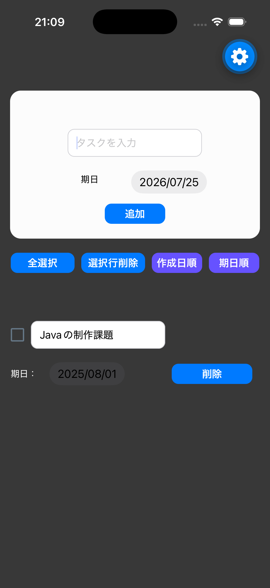

# Todo App (Expo)

このプロジェクトは、React Native と Expo を使って作成したシンプルな Todo アプリです。  
学習目的で、状態管理・コンポーネント分割・日付入力・ローカル保存の流れを実際に体験できるように構成しています。

## アプリ概要

このアプリは、日々のタスクを入力・編集・完了管理できる Todo アプリです。  
Expo で動作するモバイルアプリとして、基本的な Todo 操作を体験しやすい形で実装しています。

todo-app/simulator_screenshot_FB276D09-55C9-4947-A720-B7466FF0D8C8.png

## 使用技術

| 項目 | 内容 |
| --- | --- |
| フレームワーク | React Native |
| 開発基盤 | Expo |
| 言語 | TypeScript |
| ストレージ | AsyncStorage |
| UI | expo-checkbox, react-native-community/datetimepicker |
| ルーティング | expo-router |

## 実装機能

- Todo の追加
- Todo の編集
- Todo の削除
- チェックボックスによる完了状態の切り替え
- 全選択 / 全選択解除
- 選択済み Todo の一括削除
- 作成日順での並び替え
- 期日順での並び替え
- 期日の設定
- デバイスへの保存（AsyncStorage）

## ディレクトリ構成

```text
src/
  app/          # 画面本体
  components/   # フォーム・Todo一覧・Todoアイテム
  constants/    # テーマ関連の定数
  types/        # 型定義
assets/         # アイコンや画像素材
scripts/        # 補助スクリプト
```

## 起動方法

```bash
npm install
npx expo start
```

起動後、Expo の表示に従って iOS / Android / Web で確認できます。

## スクリーンショット



## 今後の改善案

- 優先度の設定
- カテゴリやタグによる分類
- 完了済みタスクの自動整理
- 通知機能
- 検索・フィルタ機能
- ダークモード対応
- 並び替えの保持
- ドラッグ＆ドロップによる並び替え
- クラウド同期機能
